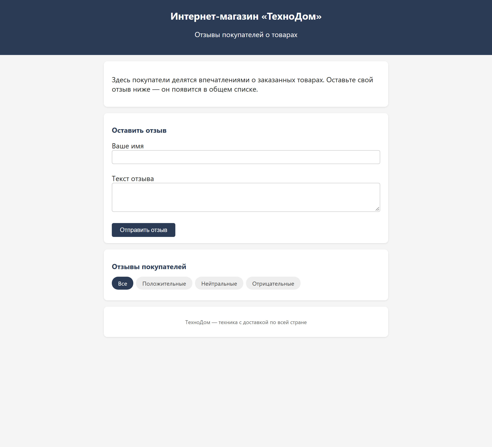
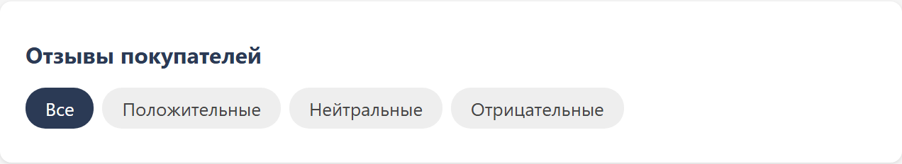
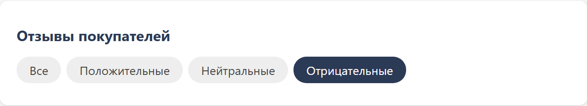
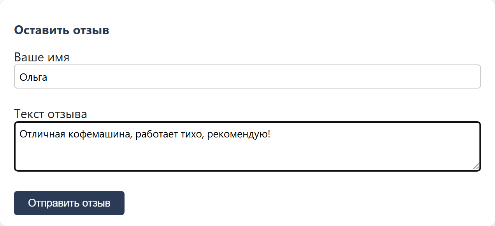

# ТехноДом — отзывы покупателей с анализом тональности

Форма отзывов для интернет-магазина: покупатель оставляет отзыв о товаре, отзыв сразу появляется в общем списке, а рядом автоматически определяется **тональность** — положительный, нейтральный или отрицательный. Менеджер видит недовольных покупателей первым же взглядом и может отфильтровать только их.

**Живая демонстрация:** https://yaroslava-111.github.io/techno-dom-reviews/

---

## 1. Что делает сервис и для кого он создан

Сервис решает одну задачу: **быстро показать, какие отзывы требуют реакции менеджера**. В обычном списке отзывов негатив приходится вычитывать глазами; здесь он помечен красным и отбирается одним кликом.

Для кого:

- **менеджер интернет-магазина** — следит за негативом и отвечает на него в первую очередь;
- **владелец небольшого магазина** — видит общее настроение покупателей без подключения платной аналитики;
- **разработчик** — может встроить блок отзывов в существующий сайт: это три файла без зависимостей.

### Возможности

- **Форма отзыва** — имя и текст; отзыв сразу появляется в общем списке.
- **Анализ тональности на стороне браузера** — без внешних сервисов и без передачи текста куда-либо.
- **Цветные метки** — зелёная «Положительный», серая «Нейтральный», красная «Отрицательный».
- **Фильтр по тональности** — «Все», «Положительные», «Нейтральные», «Отрицательные».
- **Хранение в браузере** — отзывы не пропадают после перезагрузки страницы.

---

## 2. Интерфейс

Общий вид страницы: описание, форма отзыва и список с метками тональности.



Список отзывов: у каждого отзыва имя автора и метка тональности.



Фильтр «Отрицательные» — в списке остаются только отзывы, требующие реакции.



Форма отзыва заполнена и готова к отправке.



---

## 3. Системные требования

| Что нужно | Версия | Зачем |
|---|---|---|
| Браузер Chrome, Edge, Firefox или Safari | Chrome/Edge 90+, Firefox 90+, Safari 15+ | Сам сервис |
| Git | любая актуальная | Склонировать репозиторий |
| Python | 3.8 и новее | Только для локального сервера (способ 2) |

Операционная система — любая: Windows, macOS, Linux. Node.js, базы данных, веб-сервер и интернет-соединение не нужны: всё работает в браузере.

---

## 4. Установка с чистого компьютера

### 4.1. Установите Git

- **Windows:** скачайте установщик с https://git-scm.com/download/win и пройдите его с настройками по умолчанию.
- **macOS:** выполните в терминале:

  ```bash
  xcode-select --install
  ```

- **Linux (Ubuntu/Debian):**

  ```bash
  sudo apt update && sudo apt install -y git
  ```

Проверьте, что Git установлен:

```bash
git --version
```

### 4.2. Склонируйте репозиторий

```bash
git clone https://github.com/Yaroslava-111/techno-dom-reviews.git
cd techno-dom-reviews
```

### 4.3. Установите зависимости

Зависимостей нет. Проект состоит из трёх файлов — `index.html`, `style.css`, `script.js`. Ни `npm install`, ни сборка, ни виртуальное окружение Python не требуются: шаг установки зависимостей в этом проекте отсутствует намеренно.

---

## 5. Запуск

### Способ 1. Открыть файл в браузере

Откройте `index.html` двойным щелчком. Этого достаточно в большинстве случаев.

### Способ 2. Локальный сервер (рекомендуется)

Некоторые браузеры запрещают сохранение данных при открытии файла по адресу `file://`. Тогда отзывы будут пропадать после перезагрузки. Запустите локальный сервер из папки проекта:

```bash
python -m http.server 8000
```

Если команда `python` не найдена, используйте:

```bash
python3 -m http.server 8000
```

Откройте в браузере:

```text
http://localhost:8000
```

Чтобы остановить сервер, вернитесь в терминал и нажмите `Ctrl + C`.

---

## 6. Проверка работоспособности

Автотестов в проекте нет — проверка выполняется вручную за две минуты.

### 6.1. Главный пользовательский сценарий

1. Откройте страницу любым способом из раздела 5.
2. В поле **«Ваше имя»** введите `Проверка`.
3. В поле **«Текст отзыва»** введите: `Отличный товар, очень доволен покупкой!`
4. Нажмите **«Отправить отзыв»**.
   **Ожидаемый результат:** отзыв появился в списке, рядом с именем — зелёная метка **«Положительный»**.
5. Добавьте второй отзыв с текстом: `Сломался через неделю, ужасное качество.`
   **Ожидаемый результат:** красная метка **«Отрицательный»**.
6. Нажмите кнопку фильтра **«Отрицательные»**.
   **Ожидаемый результат:** в списке остались только отрицательные отзывы.
7. Нажмите **«Все»**, затем обновите страницу клавишей `F5`.
   **Ожидаемый результат:** оба отзыва на месте — значит, сохранение в браузере работает.

Если все семь шагов прошли как описано, сервис исправен.

### 6.2. Проверка самого анализа тональности

Анализ выполняет функция `analyzeSentiment(text)` в `script.js`. Она приводит текст к нижнему регистру, считает совпадения со словарями положительных и отрицательных слов и учитывает отрицания: «не плохой» засчитывается как положительный отзыв, «не рекомендую» — как отрицательный. Побеждает тональность, чьих слов больше; при равенстве результат — «нейтральный».

Контрольные примеры:

| Текст отзыва | Ожидаемая тональность |
|---|---|
| Отличный товар, рекомендую! | положительный |
| Сломался через неделю, ужасно | отрицательный |
| Заказал, привезли через 3 дня | нейтральный |
| Товар не плохой, но цена кусается | положительный |
| Хорошее качество, но долго шла доставка | нейтральный |

---

## 7. Переменные окружения и файл `.env.example`

В базовой версии переменные окружения **не используются**: анализ тональности выполняется в браузере, ключи и секреты не нужны.

Файл `.env.example` нужен только в том случае, если вы решите заменить встроенную эвристику на вызов внешней языковой модели. Он содержит **имена** переменных без значений:

| Имя переменной | Назначение |
|---|---|
| `OPENAI_API_KEY` | Ключ доступа к API модели |
| `OPENAI_MODEL` | Идентификатор модели, которая анализирует текст |

Как подготовить файл:

```bash
cp .env.example .env
```

В Windows PowerShell:

```powershell
Copy-Item .env.example .env
```

Затем откройте `.env` и подставьте свои значения. Файл `.env` перечислен в `.gitignore` и в репозиторий не попадает — **никогда не коммитьте его**. Пример запроса к модели лежит в `PROMPT_EXAMPLE.md`.

Важно: вызов внешней модели нельзя делать прямо из браузера — ключ окажется виден любому посетителю. Для этого варианта нужен промежуточный серверный обработчик, который хранит ключ у себя.

---

## 8. Структура проекта

```text
techno-dom-reviews/
├── index.html           # Разметка страницы: форма, фильтр, список отзывов
├── style.css            # Стили и цвета меток тональности
├── script.js            # Логика: сохранение, фильтр, функция analyzeSentiment
├── .env.example         # Имена переменных окружения для варианта с внешней моделью
├── PROMPT_EXAMPLE.md    # Пример промпта для варианта с внешней моделью
├── screenshots/         # Скриншоты для этого файла
└── README.md
```

---

## 9. Публикация

Проект — статический сайт, поэтому публикуется бесплатно на GitHub Pages.

Публикация уже включена, адрес: https://yaroslava-111.github.io/techno-dom-reviews/

Как включить её в своей копии репозитория:

1. Откройте репозиторий на GitHub → **Settings** → **Pages**.
2. В разделе **Build and deployment** выберите источник **Deploy from a branch**.
3. Ветка — `main`, папка — `/ (root)`. Нажмите **Save**.
4. Через одну–две минуты сайт будет доступен по адресу `https://<ваш-логин>.github.io/techno-dom-reviews/`.

Любой другой статический хостинг (Netlify, Vercel, обычный веб-сервер) тоже подойдёт: достаточно скопировать файлы проекта в публичную папку.

---

## 10. Обновление

Обновление установленной копии — одна команда в папке проекта:

```bash
git pull
```

Затем обновите страницу в браузере сочетанием `Ctrl + F5` (на macOS — `Cmd + Shift + R`), чтобы браузер загрузил новую версию файлов, а не взял их из кеша.

Опубликованный на GitHub Pages сайт обновляется сам в течение одной–двух минут после отправки изменений в ветку `main`.

Отзывы при обновлении **не теряются**: они хранятся в браузере, а не в файлах проекта.

---

## 11. Резервное копирование и восстановление

Отзывы хранятся в браузере посетителя, в хранилище `localStorage`, под ключом `technodom-reviews`. На сервере и в файлах проекта их нет — отдельной базы данных у сервиса нет.

Что это означает на практике: отзывы видны только в том браузере и на том компьютере, где их оставили, и пропадут, если очистить данные сайта.

### Сделать резервную копию

1. Откройте страницу сервиса.
2. Нажмите `F12` → вкладка **Console**.
3. Вставьте команду и нажмите `Enter`:

   ```javascript
   copy(localStorage.getItem('technodom-reviews'))
   ```

4. Текст скопирован в буфер обмена — вставьте его в файл и сохраните, например `reviews-backup.json`.

### Восстановить из копии

1. Откройте страницу сервиса, нажмите `F12` → **Console**.
2. Выполните команду, подставив содержимое файла копии вместо `СОДЕРЖИМОЕ_ФАЙЛА_КОПИИ`:

   ```javascript
   localStorage.setItem('technodom-reviews', 'СОДЕРЖИМОЕ_ФАЙЛА_КОПИИ')
   ```

3. Обновите страницу — отзывы вернутся.

---

## 12. Известные ограничения

- **Анализ по ключевым словам не понимает сарказм и сложный контекст.** Фраза «ну просто замечательно, сломалось на второй день» будет определена как положительная. Для точного анализа нужна языковая модель (см. раздел 7).
- **Словари поддерживают только русский язык.** Отзыв на английском почти всегда получит нейтральную метку.
- **Нет общей базы отзывов.** Отзывы не видны другим посетителям: у каждого браузера своё хранилище. Для общего списка нужен серверный бэкенд с базой данных.
- **Нет модерации и защиты от спама.** Любой текст публикуется сразу, ограничения по частоте отправки нет.
- **Нет редактирования и удаления отзыва** после отправки — только очистка всего списка через хранилище браузера.
- **Нет авторизации.** Имя вводится вручную и ничем не подтверждается.

---

## 13. Если что-то не работает

| Что вы видите | Причина | Что сделать |
|---|---|---|
| Отзывы пропадают после перезагрузки | Страница открыта по `file://`, браузер блокирует хранилище | Запустите локальный сервер — способ 2 в разделе 5 |
| Страница открылась без стилей, «голый» текст | Файл `style.css` не загрузился | Проверьте, что `style.css` и `script.js` лежат рядом с `index.html`; выполните `git status` и убедитесь, что файлы не удалены |
| Кнопка «Отправить отзыв» ничего не делает | Ошибка в JavaScript | Нажмите `F12` → вкладка **Console** и прочитайте красное сообщение об ошибке |
| У всех отзывов метка «Нейтральный» | В тексте нет слов из словарей | Проверьте на контрольных примерах из раздела 6.2 |
| `python: command not found` | Python не установлен или называется `python3` | Выполните `python3 -m http.server 8000` или установите Python с https://www.python.org/downloads/ |
| `Address already in use` при запуске сервера | Порт 8000 занят другой программой | Запустите на другом порту: `python -m http.server 8080` |

### Где смотреть журнал ошибок

Своих файлов журнала у сервиса нет — всё происходит в браузере. Полная картина ошибок: `F12` → вкладка **Console**. Там же, на вкладке **Application** → **Local Storage**, видно текущее содержимое хранилища отзывов.

---

## 14. Поддержка

Вопросы, замечания и сообщения об ошибках — через раздел **Issues** этого репозитория: https://github.com/Yaroslava-111/techno-dom-reviews/issues

Автор проекта: https://github.com/Yaroslava-111
