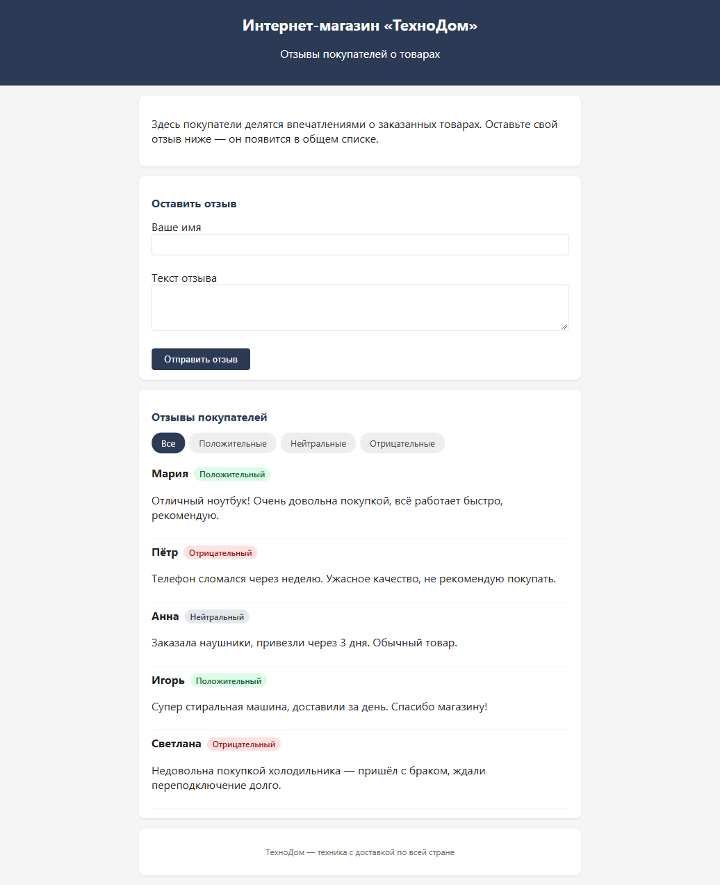
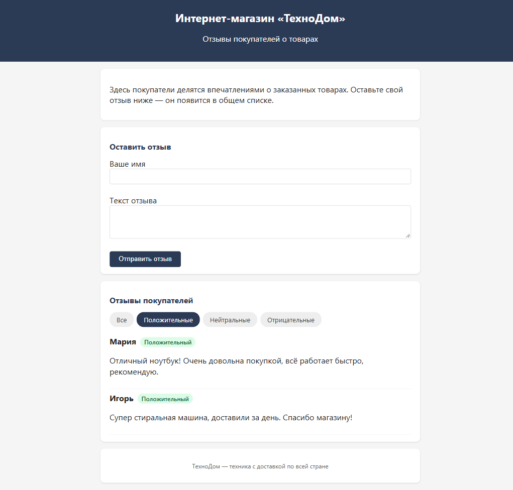

# ТехноДом — отзывы покупателей

Мини-форма отзывов для интернет-магазина «ТехноДом». Покупатели оставляют текстовый отзыв о товаре, отзыв сохраняется и показывается в общем списке. Рядом с каждым отзывом автоматически определяется **тональность** — положительный, нейтральный или отрицательный — чтобы менеджер сразу видел недовольных покупателей и реагировал в первую очередь.

## Возможности

- **Форма отзыва** — имя + текст, отзыв сразу появляется в общем списке
- **Анализ тональности текста** — эвристика по ключевым словам (без внешнего ИИ-API): положительный / нейтральный / отрицательный
- **Цветные метки** — зелёная (положительный), серая (нейтральный), красная (отрицательный)
- **Фильтрация по тональности** — «Все», «Положительные», «Нейтральные», «Отрицательные»
- **Хранение в localStorage** — отзывы не пропадают после перезагрузки страницы

## Скриншоты

### Общий вид



### Фильтр «Отрицательные»


### Фильтр «Положительные»



## Как работает анализ тональности

Анализ выполняется на клиенте функцией `analyzeSentiment(text)` в `script.js`:

1. Текст приводится к нижнему регистру.
2. Подсчитываются совпадения со словарями позитивных и негативных слов.
3. Учитываются отрицания: «не плохой» засчитывается как позитив, «не рекомендую» — как негатив.
4. Побеждает та тональность, чьих слов больше; при равенстве — `neutral`.

Примеры:

| Отзыв | Тональность |
|-------|-------------|
| «Отличный товар, рекомендую!» | положительный |
| «Сломался через неделю, ужасно» | отрицательный |
| «Заказал, привезли через 3 дня» | нейтральный |
| «Товар не плохой, но цена кусается» | положительный |
| «Хорошее качество, но долго шла доставка» | нейтральный |

## Запуск

Проект — чистые HTML/CSS/JS, без сборки и зависимостей.

### Вариант 1. Открыть файл

Откройте `index.html` двойным щелчком или через File → Open в браузере.

### Вариант 2. Локальный сервер

Если браузер блокирует `localStorage` при открытии по `file://`, запустите локальный сервер:

```bash
python -m http.server 8000
```

Затем откройте <http://localhost:8000>.

## Структура проекта

```
├── index.html      # разметка страницы
├── style.css       # стили
├── script.js       # логика: форма, тональность, фильтр
└── screenshots/    # скриншоты для README
```

## Стек

- HTML5
- CSS3
- Vanilla JavaScript (без библиотек и сборки)
- localStorage для хранения отзывов

## Ограничения

Эвристика по ключевым словам не распознаёт сарказм и сложные контексты. Для более точного анализа можно подключить внешний ИИ-API — пример промпта в `PROMPT_EXAMPLE.md`, переменные окружения в `.env.example`.